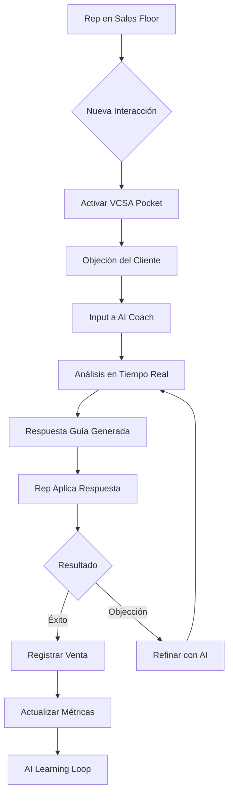
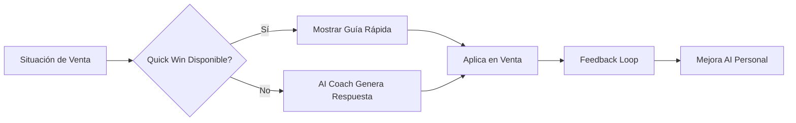
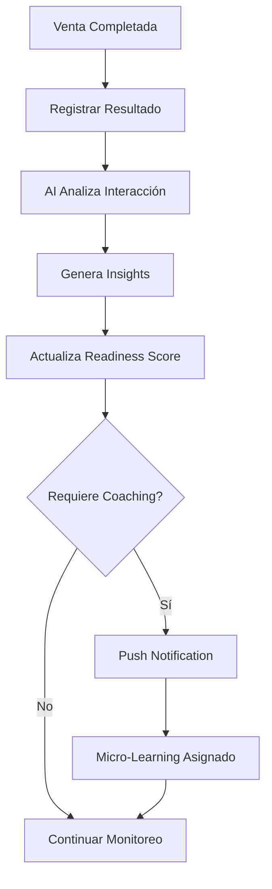

# 🎯 VCSA - Dashboard Estratégico del Proyecto

**Fecha**: 2026-04-05
**Versión**: 1.0 - Strategic Planning
**Estado**: 🚀 Phase 1 Completada - Phase 2 Pocket MVP en Planeación

---

## 📊 Ejecutivo Summary

### 🎯 Visión del Proyecto

**VCSA (Vacation Club Sales Academy)** es una plataforma de entrenamiento y rendimiento para equipos de ventas de Vacation Club, evolucionando desde un sistema de entrenamiento tradicional a una **Plataforma Operativa de Ventas** con dos verticales:

1. **VCSA Core** (Sistema actual) - Plataforma web de entrenamiento y gestión
2. **VCSA Pocket** (Nueva propuesta) - App móvil nativa para REPs en el sales floor

### 💡 Propósito Estratégico

Transformar el conocimiento teórico en **acción práctica en tiempo real** mediante:
- **Just-in-Time Learning**: Conocimiento disponible en el momento de la venta
- **AI Coaching Personalizado**: Agente que guía durante interacciones reales
- **Performance Management**: Métricas y coaching basado en datos
- **Hábito Diaria**: Herramienta de uso cotidiano, no solo entrenamiento

---

## 🏗️ Arquitectura del Sistema

### Componentes Principales

```
┌─────────────────────────────────────────────────────────────┐
│                    VCSA ECOSYSTEM                            │
├─────────────────────────────────────────────────────────────┤
│                                                               │
│  ┌──────────────────┐      ┌──────────────────┐            │
│  │   VCSA CORE      │      │  VCSA POCKET MVP  │            │
│  │   (Web Platform) │◄────►│ (Mobile App)      │            │
│  │                  │      │                  │            │
│  │ • Training       │      │ • Sales Floor     │            │
│  │ • Management     │      │ • AI Coach        │            │
│  │ • Analytics      │      │ • Quick Wins      │            │
│  │ • Content        │      │ • Performance     │            │
│  └──────────────────┘      └──────────────────┘            │
│           ▲                         ▲                       │
│           │                         │                       │
│           └─────────┬───────────────┘                       │
│                     ▼                                       │
│          ┌──────────────────────┐                          │
│          │   SHARED BACKEND     │                          │
│          │   (API Gateway)      │                          │
│          └──────────────────────┘                          │
│                     ▼                                       │
│          ┌──────────────────────┐                          │
│          │    DATA LAYER        │                          │
│          │ • MongoDB            │                          │
│          │ • Vector DB (AI)     │                          │
│          │ • Analytics DB       │                          │
│          └──────────────────────┘                          │
└─────────────────────────────────────────────────────────────┘
```

### Stack Tecnológico Actual

**VCSA Core (Web)**:
- Frontend: React 19 + Tailwind CSS + Framer Motion
- Backend: FastAPI (Python) + MongoDB
- Auth: JWT + Google OAuth
- AI: Ollama (llama3.1)

**VCSA Pocket MVP (Propuesta)**:
- Mobile: React Native / Flutter (Cross-platform)
- Backend: Compartido con VCSA Core
- AI: Ollama + OpenAI API (opcional)
- Offline: PWA + Local Storage

---

## 🔄 Flujos de Usuario

### 1. Flujo de Venta Asistida por AI (VCSA Pocket)



### 2. Flujo de Just-in-Time Learning



### 3. Flujo de Performance Management



---

## 📋 Casos de Uso

### VCSA Pocket MVP - Casos Primarios

#### 1. PRE-TOUR PREP ⏰
**Actor**: Rep de Ventas
**Propósito**: Preparación mental antes del tour

```
GIVEN Rep está por iniciar un tour
WHEN Abre VCSA Pocket "Pre-Tour Mode"
THEN Recibe:
  - 3 Quick Wins aleatorios
  - Mindset affirmation del día
  - Objection handling tips
  - Readiness score actual
  - Goal del día (ej: "Cerrar 1 venta")

ESTIMADO: 2 minutos antes de cada tour
```

#### 2. REAL-TIME COACHING 🤖
**Actor**: Rep de Ventas
**Propósito**: Asistencia durante interacción con cliente

```
GIVEN Cliente hace objeción
WHEN Rep input objeción en VCSA Pocket
THEN AI Coach:
  - Analiza objeción en contexto
  - Genera 3 respuestas posibles
  - Destaca "Key Move" principal
  - Propone ejemplos específicos
  - Ajusta tono según perfil cliente

RESPUESTA: < 3 segundos
```

#### 3. POST-TOUR DEBRIEF 📝
**Actor**: Rep de Ventas
**Propósito**: Learning automático después de cada tour

```
GIVEN Tour finalizado
WHEN Rep registra resultado
THEN Sistema:
  - Actualiza métricas personales
  - Genera insight del AI
  - Sugiere 1 mejora específica
  - Asigna micro-learning si necesario
  - Actualiza readiness score

TIEMPO: 1 minuto post-tour
```

#### 4. DAILY CHECK-IN 📅
**Actor**: Rep de Ventas
**Propósito**: Hábito diario de uso

```
GIVEN Nuevo día comienza
WHEN Rep abre VCSA Pocket
THEN Recibe:
  - Streak actual
  - Progreso semanal
  - Top 3 áreas de mejora
  - Quick Win del día
  - Goal de hoy
  - Motivational quote

FRECUENCIA: 1 vez/día (mañana)
```

---

## 🎯 Requerimientos del MVP Pocket

### Funcionales (MVP)

#### R1 - AI Coach Core
- **R1.1**: Input de texto/voz para objeciones
- **R1.2**: Respuesta en < 3 segundos
- **R1.3**: 3 opciones de respuesta generadas
- **R1.4**: Contexto de cliente (tipo, tour number, objection type)
- **R1.5**: Historial de interacciones del día

#### R2 - Quick Wins System
- **R2.1**: Library de 50+ Quick Wins
- **R2.2**: Categorización (before_tour, closing_help, objections)
- **R2.3**: Randomización diaria
- **R2.4**: Mark as favorite
- **R2.5**: One-tap application mode

#### R3 - Performance Tracking
- **R3.1**: Post-tour debrief (30 segundos)
- **R3.2**: Readiness score calculation
- **R3.3**: Daily goals tracking
- **R3.4**: Weekly trends
- **R3.5**: Comparison vs team average

#### R4 - Content Integration
- **R4.1**: Offline mode (caching de 20 Quick Wins)
- **R4.2**: Video snippets (30-60 seconds)
- **R4.3**: Audio guides (2-3 minutes)
- **R4.4**: PDF one-sheeters
- **R4.5]: Sync with VCSA Core platform

#### R5 - Notifications
- **R5.1**: Pre-tour reminders
- **R5.2]: Post-tour debrief prompt
- **R5.3**: Daily check-in
- **R5.4**: Streak maintenance
- **R5.5**: Goal achievement alerts

### No Funcionales

#### NF1 - Performance
- Tiempo de respuesta AI: < 3 segundos
- Offline mode: 80% funcionalidad sin conexión
- Battery usage: < 5% por día
- App size: < 50MB

#### NF2 - UX/UI
- One-tap para acciones principales
- Voice input disponible
- Dark mode nativo
- Responsive diseño (iOS/Android)
- Accessibility: VoiceOver/TalkBack

#### NF3 - Security
- Local data encryption
- Secure auth (biometric available)
- Privacy first (no voice recordings stored)
- GDPR compliance

#### NF4 - Integrations
- VCSA Core API
- Calendar (tour scheduling)
- CRM (opcional)
- Analytics platform

---

## 📱 VCSA Pocket MVP - Especificación Técnica

### Arquitectura Mobile

```
┌─────────────────────────────────────────────────────┐
│              VCSA POCKET MOBILE APP                  │
├─────────────────────────────────────────────────────┤
│                                                      │
│  ┌──────────────────────────────────────────────┐  │
│  │  UI LAYER (React Native)                     │  │
│  │  ┌──────────┐ ┌──────────┐ ┌──────────┐     │  │
│  │  │Pre-Tour  │ │AI Coach  │ │Debrief   │     │  │
│  │  │Mode      │ │Chat      │ │Mode      │     │  │
│  │  └──────────┘ └──────────┘ └──────────┘     │  │
│  └──────────────────────────────────────────────┘  │
│                      ▼                               │
│  ┌──────────────────────────────────────────────┐  │
│  │  BUSINESS LOGIC LAYER                        │  │
│  │  • State Management (Redux)                  │  │
│  │  • Service Layer                             │  │
│  │  • Offline Sync Manager                      │  │
│  │  • AI Client                                 │  │
│  └──────────────────────────────────────────────┘  │
│                      ▼                               │
│  ┌──────────────────────────────────────────────┐  │
│  │  DATA LAYER                                  │  │
│  │  • Local Storage (AsyncStorage)              │  │
│  │  • SQLite (offline cache)                    │  │
│  │  • API Client (axios)                        │  │
│  └──────────────────────────────────────────────┘  │
└─────────────────────────────────────────────────────┘
                      ▼
        ┌───────────────────────────────┐
        │  VCSA CORE BACKEND API        │
        │  (Shared with Web Platform)   │
        └───────────────────────────────┘
```

### Core Modules

#### 1. AI Coach Module
```typescript
interface AICoachService {
  // Generate coaching response
  generateResponse(input: CoachingInput): Promise<CoachingResponse>;

  // Voice input processing
  processVoiceInput(audio: AudioBlob): Promise<string>;

  // Context-aware suggestions
  getContextualSuggestions(context: SalesContext): Promise<QuickWin[]>;

  // Learning feedback loop
  submitFeedback(interactionId: string, result: SalesResult): Promise<void>;
}
```

#### 2. Performance Module
```typescript
interface PerformanceService {
  // Post-tour debrief
  recordTourResult(result: TourResult): Promise<void>;

  // Readiness calculation
  calculateReadiness(userId: string): Promise<ReadinessScore>;

  // Daily goals
  setDailyGoal(goal: DailyGoal): Promise<void>;

  // Progress tracking
  getWeeklyProgress(userId: string): Promise<WeeklyProgress>;
}
```

#### 3. Content Module
```typescript
interface ContentService {
  // Quick Wins library
  getQuickWins(filters: ContentFilters): Promise<QuickWin[]>;

  // Offline content management
  syncOfflineContent(): Promise<void>;

  // Favorite management
  toggleFavorite(contentId: string): Promise<void>;

  // Search
  searchContent(query: string): Promise<ContentItem[]>;
}
```

---

## 🗺️ Planificación Kanban - MVP Pocket

### Phase 1: Foundation (Sprint 1-2) - 4 semanas

#### Sprint 1: Infraestructura Core
```
KANBAN - SPRINT 1
├─ BACKLOG
│  ├─ [EPIC] Mobile App Setup
│  ├─ [EPIC] Backend API Extensions
│  └─ [EPIC] AI Integration
│
├─ TODO
│  ├─ [TASK] React Native project initialization
│  ├─ [TASK] Navigation structure (stack navigator)
│  ├─ [TASK] State management setup (Redux)
│  ├─ [TASK] API client configuration
│  └─ [TASK] Authentication flow
│
├─ IN PROGRESS
│  └─ [TASK] Design system components (UI Kit)
│
└─ DONE
   ├─ [TASK] Repository setup
   ├─ [TASK] CI/CD pipeline
   └─ [TASK] Development environment

ASIGNACIONES:
- Frontend Mobile: @mobile-dev-lead (40h/semana)
- Backend API: @backend-dev (20h/semana)
- UI/UX Design: @designer (10h/semana)
- AI Integration: @ai-engineer (10h/semana)
```

**Subtareas Sprint 1**:

1. **Mobile Setup** (@mobile-dev-lead)
   - [ ] React Native init (TypeScript)
   - [ ] Navigation structure (5 screens)
   - [ ] Redux store setup
   - [ ] API client (axios)
   - [ ] Auth flow (JWT)

2. **Backend Extensions** (@backend-dev)
   - [ ] Mobile API endpoints
   - [ ] AI Coach service
   - [ ] Performance tracking API
   - [ ] Offline sync endpoints

3. **AI Integration** (@ai-engineer)
   - [ ] Ollama client setup
   - [ ] Prompt engineering templates
   - [ ] Context management
   - [ ] Response optimization

#### Sprint 2: Core Features
```
KANBAN - SPRINT 2
├─ BACKLOG
│  ├─ [EPIC] AI Coach MVP
│  ├─ [EPIC] Quick Wins System
│  └─ [EPIC] Performance Tracking
│
├─ TODO
│  ├─ [TASK] AI Coach chat UI
│  ├─ [TASK] Quick Wins library viewer
│  ├─ [TASK] Pre-Tour mode
│  └─ [TASK] Post-Tour debrief
│
├─ IN PROGRESS
│  ├─ [TASK] Voice input integration
│  └─ [TASK] Offline mode setup
│
└─ DONE
   └─ [TASK] Basic app structure

ASIGNACIONES:
- Frontend Mobile: @mobile-dev-lead (40h)
- AI Features: @ai-engineer (20h)
- Backend: @backend-dev (10h)
- Testing: @qa-engineer (10h)
```

### Phase 2: MVP Features (Sprint 3-4) - 4 semanas

#### Sprint 3: AI Coach & Quick Wins
```
KANBAN - SPRINT 3
├─ BACKLOG
│  └─ [EPIC] Advanced AI Features
│
├─ TODO
│  ├─ [TASK] AI Coach advanced prompts
│  ├─ [TASK] Context awareness engine
│  ├─ [TASK] Quick Wins categorization
│  └─ [TASK] Favorites system
│
├─ IN PROGRESS
│  ├─ [TASK] AI response UI refinement
│  └─ [TASK] Quick Wins offline sync
│
└─ DONE
   ├─ [TASK] AI Coach basic flow
   └─ [TASK] Quick Wins viewer

ASIGNACIONES:
- AI Development: @ai-engineer (30h)
- Frontend Polish: @mobile-dev-lead (20h)
- Content Creation: @content-specialist (10h)
```

#### Sprint 4: Performance & Testing
```
KANBAN - SPRINT 4
├─ BACKLOG
│  └─ [EPIC] Production Readiness
│
├─ TODO
│  ├─ [TASK] Performance optimization
│  ├─ [TASK] Battery usage optimization
│  ├─ [TASK] Security audit
│  └─ [TASK] Beta testing program
│
├─ IN PROGRESS
│  ├─ [TASK] Unit testing (80% coverage)
│  └─ [TASK] Integration testing
│
└─ DONE
   ├─ [TASK] Core features
   └─ [TASK] Basic performance

ASIGNACIONES:
- QA & Testing: @qa-lead (20h)
- Optimization: @mobile-dev-lead (15h)
- Security: @security-engineer (10h)
- Docs: @tech-writer (5h)
```

### Phase 3: Production Launch (Sprint 5-6) - 4 semanas

#### Sprint 5: Beta & Polish
```
KANBAN - SPRINT 5
├─ BACKLOG
│  └─ [EPIC] Launch Preparation
│
├─ TODO
│  ├─ [TASK] Beta program (50 users)
│  ├─ [TASK] Feedback collection system
│  ├─ [TASK] Bug fixes priority
│  └─ [TASK] Performance monitoring
│
├─ IN PROGRESS
│  ├─ [TASK] App Store optimization
│  └─ [TASK] Marketing materials
│
└─ DONE
   ├─ [TASK] MVP features complete
   └─ [TASK] Testing suite

ASIGNACIONES:
- PM & Operations: @product-manager (20h)
- Development: @mobile-dev-lead (15h)
- Support: @customer-success (10h)
```

#### Sprint 6: Launch
```
KANBAN - SPRINT 6
├─ BACKLOG
│  └─ [EPIC] Post-Launch Support
│
├─ TODO
│  ├─ [TASK] App Store submission
│  ├─ [TASK] Launch day coordination
│  ├─ [TASK] User onboarding flow
│  └─ [TASK] Analytics dashboard
│
├─ IN PROGRESS
│  ├─ [TASK] Final QA pass
│  └─ [TASK] Documentation
│
└─ DONE
   ├─ [TASK] Beta testing
   └─ [TASK] Marketing assets

ASIGNACIONES:
- Full Team Availability (Launch Week)
```

---

## 💰 Budget y Recursos

### Equipo de Desarrollo (12 semanas)

```
ROL                         HORAS/SEMANA  SUELDO MENSUAL  TOTAL
─────────────────────────────────────────────────────────
@mobile-dev-lead (Senior)     40h          $8,000        $24,000
@backend-dev                  15h          $4,000        $12,000
@ai-engineer                  20h          $7,000        $21,000
@ui-ux-designer               10h          $3,500        $10,500
@qa-engineer                  15h          $3,500        $10,500
@product-manager              10h          $4,000        $12,000
@content-specialist           10h          $2,500        $7,500
@tech-writer                  5h           $2,000        $6,000

SUBTOTAL PERSONAL:                                             $103,500

INFRAESTRUCTURA:
- Servidores desarrollo      3 meses       $1,000         $3,000
- API keys (AI services)     3 meses       $2,000         $6,000
- Testing devices                                       $5,000
- Software licenses                                        $2,000

SUBTOTAL INFRAESTRUCTURA:                                    $16,000

SERVICIOS EXTERNOS:
- App Store fees                                         $100
- Beta testing incentives                                 $2,000
- Security audit                                         $5,000

SUBTOTAL SERVICIOS:                                         $7,100

CONTINGENCIA (15%):                                         $18,000

TOTAL MVP POCKET (12 semanas):                              $144,600
```

### Costos de Operación Mensual (Post-Launch)

```
SERVICIO                    COSTO MENSUAL
──────────────────────────────────────
Servidores + API            $2,000
AI Services (Ollama/OpenAI) $1,500
Monitoring + Analytics      $500
Support (1 FTE)             $4,000
Maintenance (20% dev)       $8,000

TOTAL MENSUAL:              $16,000
```

---

## 📊 Métricas de Éxito del MVP

### KPIs de Producto

#### Adoption (Adopción)
- DAU/MAU ratio: > 40% (uso diario)
- Activation rate: > 70% (completan onboarding)
- Retention D7: > 60% (día 7)
- Retention D30: > 40% (día 30)

#### Engagement (Compromiso)
- Daily sessions: 3+ por usuario
- Session duration: 2-5 minutos
- AI Coach usage: 2+ consultas/día
- Quick Wins applied: 1+ por día

#### Business Impact (Impacto de Negocio)
- Rep satisfaction: > 4.5/5
- Sales lift: > 15% en usuarios activos
- Tour conversion: > 10% improvement
- Time to first sale: -20% para nuevos reps

#### Technical (Técnicos)
- App crash rate: < 0.5%
- Response time AI: < 3 segundos
- Offline mode usage: > 30%
- Battery impact: < 5% diario

---

## 🎯 Estrategia Go-to-Market

### Phase 1: Alpha (Semanas 1-4)
- **Objetivo**: Validar core features
- **Usuarios**: 5 internal users
- **Métricas**: Bug reports, feature validation
- **Feedback**: Daily standups

### Phase 2: Beta (Semanas 5-8)
- **Objetivo**: Probar en environment real
- **Usuarios**: 50 REPs de 1 cliente piloto
- **Métricas**: Engagement, satisfaction
- **Feedback**: Weekly surveys

### Phase 3: Launch (Semanas 9-12)
- **Objetivo**: Lanzamiento público
- **Usuarios**: 500 REPs (10 clientes)
- **Métricas**: Adoption, revenue impact
- **Marketing**: Case studies, testimonials

### Pricing Strategy

```
PLAN                PRECIO/REP/MES  FEATURES
─────────────────────────────────────────────
Starter             $29              • AI Coach (50 consultas/día)
                                     • Quick Wins library
                                     • Basic tracking

Professional        $59              • AI Coach (ilimitado)
                                     • Advanced analytics
                                     • Voice input
                                     • Offline mode

Enterprise          $99/rep          • Todo Professional +
                                     • Manager dashboard
                                     • Custom content
                                     • API access
                                     • Priority support
```

---

## 🔄 Roadmap Post-MVP

### Q3 2026: Advanced Features
- AI Voice Coach (conversational)
- Real-time transcription
- Video coaching
- Advanced analytics dashboard

### Q4 2026: Platform Expansion
- Team collaboration features
- Manager coaching tools
- Custom content builder
- Integration with major CRMs

### Q1 2027: AI Evolution
- Predictive coaching
- Automated training paths
- Gamification 2.0
- Social learning features

---

## 📱 Actuales Digitales del Proyecto

### Código Fuente
- **VCSA Core**: 50,000+ líneas de código
- **Backend API**: 30+ endpoints
- **Frontend**: 40+ componentes React
- **Database**: 12 collections MongoDB

### Contenido
- **Training Content**: 6 tracks, 36 módulos
- **Quick Wins**: 50+ tácticas
- **Deal Breakdowns**: 15 escenarios
- **Video Content**: 2+ horas de material

### Actuales Técnicos
- **Docker**: Contenedores production-ready
- **CI/CD**: Pipeline configurado
- **Monitoring**: Health checks activos
- **API Documentation**: Swagger/OpenAPI

---

## 🚀 Próximos Pasos Inmediatos

### 1. Aprobación del Plan (Semana 0)
- [ ] Stakeholder review
- [ ] Budget approval
- [ ] Team assignment
- [ ] Sprint planning

### 2. Sprint 1 Kickoff (Semana 1)
- [ ] Repository setup
- [ ] Development environment
- [ ] Design handoff
- [ ] API specification finalization

### 3. MVP Development (Semanas 2-11)
- [ ] Follow Kanban plan
- [ ] Weekly sprints
- [ ] Continuous testing
- [ ] Beta program integration

### 4. Launch Preparation (Semana 12)
- [ ] App Store submission
- [ ] Marketing materials
- [ ] Support documentation
- [ ] Team training

---

## 📞 Status y Continuación

**ESTADO ACTUAL**: 🎯 **PLAN COMPLETO - ESPERANDO APROBACIÓN**

**EN QUÉ SEGUIMOS**:
1. ✅ **VCSA Core** completado y funcional
2. 📋 **VCSA Pocket MVP** plan estratégico completo
3. 🎯 **Kanban planning** detallado con asignaciones
4. 💰 **Budget** y recursos estimados
5. 📊 **KPIs** y métricas definidas
6. 🚀 **Go-to-market strategy** establecida

**PRÓXIMA ACCIÓN**:
1. Reunión con stakeholders para aprobación
2. Asignación de equipo de desarrollo
3. Sprint 1 kickoff (mobile app setup)
4. Definición de fecha de lanzamiento objetivo

**TIMELINE PROPUESTO**:
- **Inicio**: Inmediato (post-aprobación)
- **MVP Launch**: 12 semanas
- **Production Ready**: 14 semanas (con buffer)
- **Market Expansion**: 6 meses post-launch

---

**¿LISTO PARA COMENZAR?** 🚀

El plan está completo. Los activos digitales existen. La arquitectura está definida. El equipo está estimado.

**Decisiones Pendientes**:
1. Aprobar budget de $144,600 USD
2. Confirmar timeline de 12 semanas
3. Asignar equipo de desarrollo
4. Definir cliente piloto para Beta

¿Procedemos con el desarrollo del MVP Pocket?
